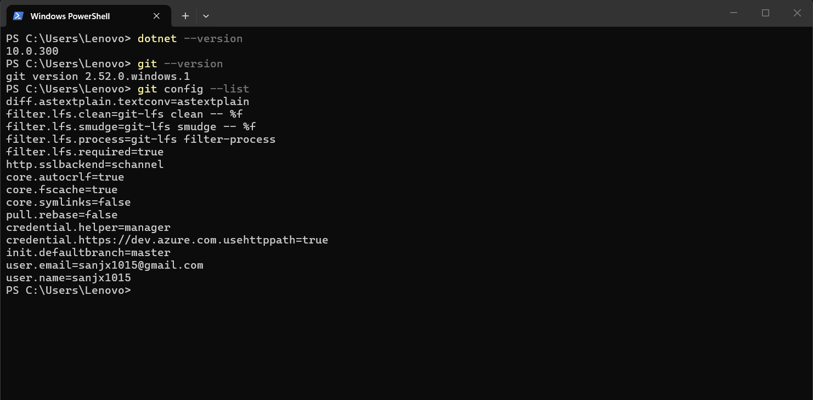
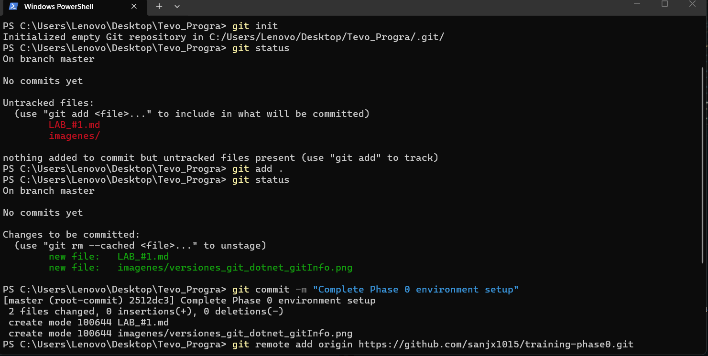

# Apprentice Training Program — Roadmap

> Training path from zero to productive junior developer.
> Target learner: electronics background, basic concepts, no programming experience.
> Language path: C# first → web fundamentals → Camus Labs stack.
> 
>All learning is practical and exercise-driven. No lectures — build things.

## Philosophy

- Every concept is learned by building something that works.
- Each module has a clear deliverable (a running program, a passing test, a deployed app).
- Progress is gated: complete the deliverable before moving on.
- The trainer reviews code and gives feedback — like a real code review.

---

## Phase 0 — Environment Setup (Week 1)

*Goal:* Learner has a working dev environment and can run code.

| # | Exercise | Deliverable |
| - | -------- | ----------- |
| 1 | Install VS Code + extensions (C# Dev Kit, GitLens) | Screenshot: VS Code open with extensions |
| 2 | Install .NET SDK (latest LTS) | Run dotnet --version in terminal |
| 3 | Install Git + configure identity | git config --list shows name and email |
| 4 | Create a GitHub account | Profile URL |
| 5 | Create first repo, clone it, make a commit, push | Commit visible on GitHub |
| 6 | Run dotnet new console → Hello World | Program prints "Hello World" to terminal |

>>> # -------------------------------

## Info Extra

 **C# :**

 Lenguaje de promagramación orientado a objetos y uno de los 5 principales lenguajes de programación de GitHub. Es el sucesor de C++. 

Es parte de la plataforma .NET de Microsft(API que se a convertido en una de las principales plataformas de desarrollo debido a la facilidad que ofrece para la construcción de todo tipo de aplicaciones multiplataformas sólidas y duraderas)

Lenguaje de programación orientada a objetos. 

Esta diseñada para la plataforma .NET de Microsoftr, pero tambien permite escribir programas para plataformas: Unix, Android, iOS, etc.

Se puede usar para desarrollar todo tipo de aplicaciones (videojuegos o aplicaciones Web)

C# esta destinado a usarse para desarrollo de programas y aplicaciones gráficas con mayor nivel de abstracción, mientras que C++  tenia un uso más general. desde niveles bajos con sistemas embebidos(dispositivo para realizar tareas especificas dentro de un sistema más amplio) 

**.NET**  es la plataforma donde se ejecuta C#

Ventajas:

- Disminuir el tiempo de desarrollo de los proyectos
- Simplificar el mantenimiento de las aplicaciones desarrolladas en la plataforma
- Reducción de costes debido a la  diisminución de los tiempos de desarrollo y de mantenimiento

>>> ## Comprobación Versiones de Git y Dotnet

 

>>> ## Repositorio GitHub

 