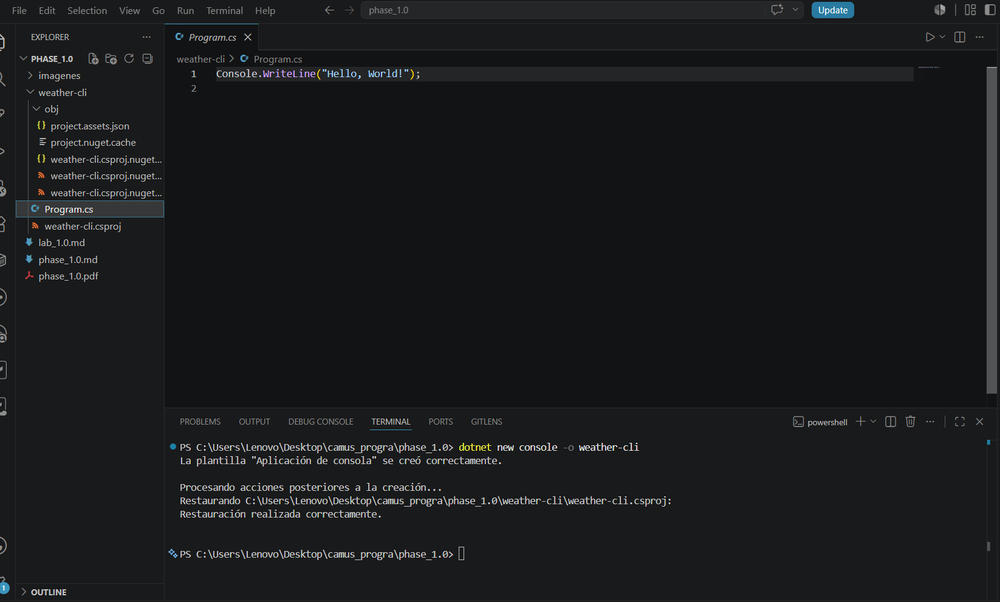

# Block 3.1 -LINQ

LINQ (Language Integrated Query) es una herramienta de C# para consultar y manipular datos de múltiples fuentes. Elimiando la necesidad de escribir bucles complejos.

## 1) 

- el `program.cs` es donde escribiremos el codigo

- `weather-cli.csproj` es el archivo de configuración del proyecto, se guarda la versión .NET, los paquetes NuGet, y las configuraciones del proyecto.

- `obj/` se crea automaticamente por .NET, *no se debe modificar, por que?*

- se hace el `dotner run` para recompilar el programa y ejecutar la versión mas reciente.

Ahora el C# 9, se puede escribir directamente, se crea automaticamente la clase Program y el método main.

## 2) 
`record` es un tipo de dato que sirve par aalmacenar información. Le dice a C# que; cada lectura del clima siempre tendrá una fecha, una condición y una temperatura. 

- ` record DailyReading(DateOnly Date, string Condition,
double TempC);`

- Se crea un tipo llamado `DailyReading` es el molde/plantilla. Luego el `DateOnly Date` es un tipo de dato de C# que almacena únicamente una fecha(15/01/2005). `string Condition,` dice que esta Sunny, o Rainy. Y el `double TempC` representa los nuneros decimales para la temperatura, la C indica que es el Celsius.

## 3) 
```
using System;
using System.Collections.Generic;

// A partir de aquí comienza el programa
List<DailyReading> readings = new()
{
    new DailyReading(new DateOnly(2026, 7, 1), "Sunny", 31),
    new DailyReading(new DateOnly(2026, 7, 2), "Rainy", 25),
    new DailyReading(new DateOnly(2026, 7, 3), "Cloudy", 28),
    new DailyReading(new DateOnly(2026, 7, 4), "Sunny", 33),
    new DailyReading(new DateOnly(2026, 7, 5), "Windy", 26),
    new DailyReading(new DateOnly(2026, 7, 6), "Rainy", 24),
    new DailyReading(new DateOnly(2026, 7, 7), "Sunny", 32),
    new DailyReading(new DateOnly(2026, 7, 8), "Cloudy", 27),
    new DailyReading(new DateOnly(2026, 7, 9), "Sunny", 34),
    new DailyReading(new DateOnly(2026, 7, 10), "Rainy", 23)
};

Console.WriteLine("=== Weather CLI ===\n");

foreach (DailyReading reading in readings)
{
    Console.WriteLine($"{reading.Date} | {reading.Condition} | {reading.TempC}°C");
}

// Definición del tipo
record DailyReading(DateOnly Date, string Condition, double TempC);
```

## 4 y 5)
Todo lo anterior a sido sin LINQ, haciendo uso del `foreach`. Con esto estamos recorruendo toda la lista llamada `readings`. Con blucles puede funcionar pero si queremos, ordenar, agrupar, sacar promedios, etc, se necesitarian muchos "foreach". Por eso existe LINQ.

- `var hotDays = readings.Where(r => r.TempC > 30);` 

Aqui `readings` es nuestra linea, el `.Where(...)` filtra la colección que le demos. Y lo que esta adentro en la expresión "lambda" se lee: Para cada elemento r verificque si TempC es mayor que 30. Y la colección "hotDats"  tendria las temperaturas mayores a 30.


```
using System;
using System.Collections.Generic;

// A partir de aquí comienza el programa
List<DailyReading> readings = new()
{
    new DailyReading(new DateOnly(2026, 7, 1), "Sunny", 31),
    new DailyReading(new DateOnly(2026, 7, 2), "Rainy", 25),
    new DailyReading(new DateOnly(2026, 7, 3), "Cloudy", 28),
    new DailyReading(new DateOnly(2026, 7, 4), "Sunny", 33),
    new DailyReading(new DateOnly(2026, 7, 5), "Windy", 26),
    new DailyReading(new DateOnly(2026, 7, 6), "Rainy", 24),
    new DailyReading(new DateOnly(2026, 7, 7), "Sunny", 32),
    new DailyReading(new DateOnly(2026, 7, 8), "Cloudy", 27),
    new DailyReading(new DateOnly(2026, 7, 9), "Sunny", 34),
    new DailyReading(new DateOnly(2026, 7, 10), "Rainy", 23)
};

Console.WriteLine("=== Weather CLI ===\n");

foreach (DailyReading reading in readings)
{
    Console.WriteLine($"{reading.Date} | {reading.Condition} | {reading.TempC}°C");
}

Console.WriteLine();

Console.WriteLine("ingrese la temperatura: ");
double limite = double.Parse(Console.ReadLine()!);

var HotDays = readings.Where(r => r.TempC > limite);

Console.WriteLine($"\nDías con temperatura mayor a {limite}°C:");

foreach (DailyReading reading in HotDays)
{
    Console.WriteLine($"{reading.Date} | {reading.Condition} | {reading.TempC}°C");
}

// Definición del tipo
record DailyReading(DateOnly Date, string Condition, double TempC);
```


## 6) 

```
Console.WriteLine("\n=== Estadísticas por condición ===");

var groups = readings.GroupBy(r => r.Condition);

foreach (var group in groups)
{
    Console.WriteLine($"\nCondición: {group.Key}");
    Console.WriteLine($"Cantidad de días: {group.Count()}");
    Console.WriteLine($"Temperatura promedio: {group.Average(r => r.TempC):F1}°C");
}
```
- Agrupa todas las lecturas usando la propiedad Condition
- Se recorren grupos completos, altes eran solo lecturas. Cada grupo representa: Sunny o Rainy
- el `group.key` es el nombre del grupo puede ser (sunny)
- el `.count` cuenta cuantos elementos tiene ese grupo.
- el `Average(r => r.TempC)` se encarga de sacar el promedio
- el `:F1` es un formato numerico que redondea los decimales a 1 decimal, con F2 seria 2 decimales, y asi puede seguir

**Conceptos de LINQ**

|Metodo|Qué hace?|Ejemplo|
|---|---|---|
|Where()| Filtra elementos| Temperatura mayores a 30
|OrderByDescending()| Ordena de mayor a menor | 34-33-32
|Take(3)| Toma los primeros 3| Top 3 mas calientes
|GoupBy()| Agrupar | Duas por condicion climatica
|Count()| Contar elementos | Numero de dias por condicion
|Average()| Calcular el promedio| Temperatura promedio por condicion

## 7) Usando el Where()

**Actualmente**
```
var hotDays = readings.Where(r => r.TempC > threshold);

Console.WriteLine($"\nDías con temperatura mayor a {threshold}°C:");

foreach (DailyReading day in hotDays)
{
    Console.WriteLine($"{day.Date} | {day.Condition} | {day.TempC}°C");
}
```

**Manualmente**

```
Console.WriteLine("\n=== La misma consulta usando foreach ===");

foreach (DailyReading reading in readings)
{
    if (reading.TempC > threshold)
    {
        Console.WriteLine($"{reading.Date} | {reading.Condition} | {reading.TempC}°C");
    }
}
```

LINQ es mas corto, mas facil de leer, util para consultas, ideal para filtrar, ordenar y agrupar. Foreach lo hace mas complejo. Sin embargo, LINQ internamente usa foreach.**IMPORTANTE preguntar**

# Block 3.2 -Dictionaties and HashSets
